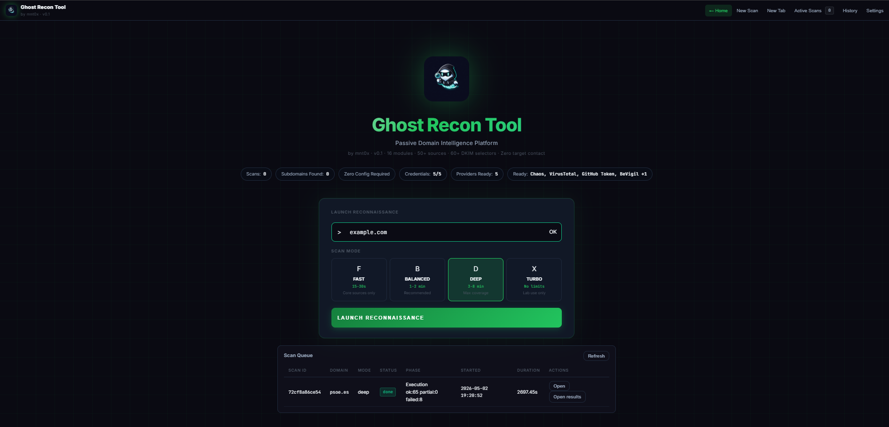
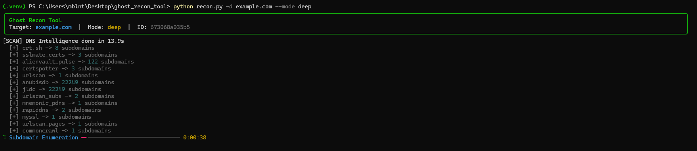

<p align="center">
  
</p>

# Ghost Recon Tool

[](https://www.python.org/downloads/)
[](LICENSE)
[](#passive-only-by-design)
[](#)

> Passive OSINT domain reconnaissance with a CLI and a local web UI — no contact with the target, ever.

Ghost Recon Tool (GRT) collects publicly available intelligence about a domain — DNS, certificates, web archives, exposed assets, leaked references, ASNs, technologies — and consolidates it into a single canonical report. It is built around a strict passive-only policy: every source is a third party (certificate transparency logs, web archives, public scan databases, code search, breach feeds), so the target sees no traffic and no probes from your infrastructure.

The same engine drives a CLI for scripted workflows and a local web UI at `http://localhost:5000` for interactive review and download of reports.

---

## Quick Start

```bash
git clone https://github.com/mnt0x/ghost_recon_tool.git
cd ghost_recon_tool
python -m venv .venv
. .venv/bin/activate            # Windows: .venv\Scripts\activate
pip install -r requirements.txt
python recon.py -d example.com  # first scan, no keys required
```

To launch the web UI instead:

```bash
python recon.py --no-browser
# open http://localhost:5000
```

---
<p align="center">
  
</p>

<p align="center">
  
</p>


## Features

- 🛰️  **Passive-only by design.** Default policy blocks any module that would touch the target. Web and CLI share the same engine and the same `policy.passive_only=true` enforcement.
- 🧩  **19 evidence classes** in one report: DNS, subdomains, emails, technologies, WHOIS, IPs, SSL/CT, web archive, breaches, reputation, cloud assets, typosquats, social footprint, ASN intelligence, dorks, passive artifacts, vulnerabilities, risk scoring, correlations.
- 🔑  **Optional API keys, optional uplift.** Works fully without keys; five free-tier providers add coverage when configured.
- 📂  **Multi-format outputs.** JSON, plain text, interactive HTML, static HTML bundle, and ZIP downloads from the same scan.
- 🌐  **Local web UI.** Saved scan history, lazy-loaded sections for large reports, and direct downloads — all on `localhost`.
- 🧪  **Strict content rules.** No synthetic emails, no fabricated dorks, no version-less CVEs, no absence-based findings.

---

## Architecture

GRT is a single Python application with two entry surfaces (CLI and aiohttp web server) sharing one engine, one policy model, and one report builder.

```
                                ┌────────────────────────────┐
   recon.py -d example.com ──▶  │       CLI entry            │ ─┐
                                └────────────────────────────┘  │
                                                                ▼
   recon.py --no-browser  ──▶   ┌────────────────────────────┐  ┌──────────────────────┐
                                │   aiohttp WebServer        │ ─▶│   ReconEngine.run()  │
                                │   localhost:5000           │  │   (passive modules)  │
                                └────────────────────────────┘  └──────┬───────────────┘
                                                                       │
                                                                       ▼
                          ┌────────────────────────────────────────────────────────────┐
                          │  ScanPolicy (passive_only=true)  +  SourceRegistry          │
                          │  HttpGuard (per-scan rate limit, retries, request logging)  │
                          └────────────────┬───────────────────────────────────────────┘
                                           │
            ┌──────────────────────────────┴──────────────────────────────┐
            │                                                             │
            ▼                                                             ▼
   Public passive sources                                       Optional keyed sources
   (Wayback, Common Crawl, URLScan,                             (Chaos, VirusTotal,
    crt.sh, certspotter, OTX, Shodan                             GitHub Code, BeVigil,
    InternetDB, HackerTarget, etc.)                              AlienVault OTX)
                                           │
                                           ▼
                                ┌──────────────────────────┐
                                │   ReportBuilder          │
                                │   - canonical report.json│
                                │   - report.txt           │
                                │   - report.html          │
                                │   - web_summary.json     │
                                │   - web_sections/*.json  │
                                │   - full_static_report   │
                                │   - downloadable ZIP     │
                                └──────────────────────────┘
```

### Passive-only by design

- Two evidence classes ship **disabled by default**: takeover detection and security-headers probing. Both would require direct contact with the target. They are part of the catalog for future opt-in but are off out of the box.
- The shared HTTP guard binds its state per scan, so request budgets are isolated and the policy gate cannot be bypassed by reusing a previous scan's session.
- `policy.passive_only=true` is recorded in every report so reviewers can verify enforcement after the fact.

---

## Usage

### CLI

```bash
# Quick scan: smallest surface, fastest, suitable for triage.
python recon.py -d example.com --mode quick

# Standard scan: default depth, balanced runtime and coverage.
python recon.py -d example.com --mode standard

# Deep scan: maximum passive coverage, longer runtime, full archive paging.
python recon.py -d example.com --mode deep

# Force run without API keys even if present.
python recon.py -d example.com --no-keys

# Pick output formats explicitly.
python recon.py -d example.com --output json,html,txt

# Verify provider readiness, dependencies, and template integrity.
python recon.py --doctor
```

Useful flags:

| Flag | Effect |
|---|---|
| `-d, --domain DOMAIN` | Target domain |
| `--mode {quick,standard,deep}` | Scan depth profile |
| `--output {json,html,txt,zip,all}` | One or more formats, comma-separated |
| `--no-keys` | Ignore configured keys for this run |
| `--no-browser` | Start web UI without auto-opening a browser |
| `--doctor` | Self-check providers, dependencies, and templates |
| `-h, --help` | Full flag list |

### Web UI

```bash
python recon.py             # opens browser at http://localhost:5000
python recon.py --no-browser  # same server without auto-opening
```

The web UI lets you:

- Launch and monitor scans with live progress.
- Review past scans from local history.
- Open large reports with lazy-loaded sections (no 1 GB DOM payloads).
- Download standalone HTML, full static HTML, ZIP bundles, JSON, and CSV exports.
- Configure API keys behind an admin login (HttpOnly cookie, `SameSite=Strict`).

### Outputs

Every scan can produce:

| File | Purpose |
|---|---|
| `report.json` | Canonical machine-readable report — every entity, finding, and source-status field |
| `report.txt` | Plain-text summary, grep-friendly |
| `report.html` | Interactive HTML with the lazy-loading runtime |
| `web_summary.json` + `web_sections/*.json` | Sidecars used by the web UI for fast initial paint |
| `full_static_report.html` | Self-contained HTML bundle for offline review |
| `report.zip` | Bundle of the above for archival or sharing |

---

## API Keys (optional)

GRT runs with no keys. Adding any of the five providers below increases coverage; all five offer free tiers and are unrelated to active scanning.

| Provider | Adds | Free sign-up |
|---|---|---|
| Chaos (ProjectDiscovery) | High-volume passive subdomain enumeration | https://chaos.projectdiscovery.io |
| VirusTotal | Passive DNS, additional subdomain hits, file/URL reputation | https://www.virustotal.com/gui/join-us |
| GitHub Token | GitHub Code search dorks (config files, credentials, email exposure) | https://github.com/settings/tokens |
| BeVigil | Mobile-app-derived subdomain footprint | https://bevigil.com/osint-api |
| AlienVault OTX | Passive DNS, malware/abuse indicators | https://otx.alienvault.com/api |

Configure them via `.env` (copy `.env.example`), the system keyring, or the web UI settings page. Precedence: web session → keyring → local store → environment → `.env`. Keys are never written to reports.

---

## Comparison

GRT focuses on a narrow goal — passive domain recon with a clean report — instead of trying to be a full graph platform. The table below is a factual feature matrix, not a ranking.

| Feature | Ghost Recon Tool | Maltego CE | SpiderFoot | theHarvester | Amass | subfinder |
|---|:---:|:---:|:---:|:---:|:---:|:---:|
| Passive-only enforced policy | ✓ | partial | configurable | ✓ | configurable | ✓ |
| Free / open-source | ✓ (MIT) | freemium | ✓ | ✓ | ✓ | ✓ |
| Local web UI | ✓ | desktop GUI | ✓ | – | – | – |
| Single binary / `pip install` workflow | ✓ | – | ✓ | ✓ | ✓ | ✓ |
| Subdomain enumeration | ✓ | ✓ | ✓ | ✓ | ✓ | ✓ |
| Email discovery | ✓ | ✓ | ✓ | ✓ | – | – |
| Web archive ingestion (Wayback, CC) | ✓ | – | partial | – | – | – |
| Cert transparency aggregation | ✓ | – | ✓ | partial | ✓ | ✓ |
| Versioned-CVE vulnerability mapping | ✓ | – | partial | – | – | – |
| Risk scoring + correlations | ✓ | – | ✓ | – | – | – |
| Built-in static HTML report | ✓ | – | partial | – | – | – |
| 19 evidence classes in one report | ✓ | requires transforms | ✓ | – | – | – |

Status of competing tools is based on their documented public behavior at the time of this release; verify against their current docs.

---

## Validation

Version 0.1 was validated end-to-end across 28 scans (7 domains × 4 modes: CLI/Web × no-keys/with-keys) covering small, medium, and high-surface targets. Aggregate results from those scans, all read directly from `report.json`:

- 28/28 status `COMPLETED`
- `policy.passive_only=true` in every report
- 2,572 vulnerabilities reported, 2,572 with versioned `CVE-YYYY-NNNN`, 0 version-less, 0 absence-based findings
- 0 fabricated dorks (only sources: passive web archives, URLScan, and — when the GitHub token is configured — github code search)
- 0 takeovers (module disabled by default; would require active probing)
- No-keys runs: `api_enabled_count=0`, `missing_credentials=5` in 14/14 reports
- With-keys runs: `api_enabled_count=5`, `missing_credentials=0` in 14/14 reports

---

## Roadmap

Direction, not deadlines. Subject to change.

- Stricter RFC 5321/5322 email extractor to reduce parsing noise on heavily templated archives.
- Optional plugin interface for community-contributed passive sources.
- Result diffing between two scans of the same domain.
- Internationalization of the web UI strings.
- Optional opt-in active modules (still off by default), gated behind explicit flags and clear scope warnings.

---

## Contributing

Issues and pull requests are welcome. For bugs, please include the GRT version, the scan mode, the target domain (or a redacted equivalent), and the relevant section of `report.json` that shows the problem. For feature ideas, open an issue first to discuss scope before submitting code. This is a single-maintainer project, so review cadence is best-effort.

---

## License

Released under the MIT License. See [`LICENSE`](LICENSE).

---

## Acknowledgments

GRT stands on a stack of open-source libraries and public passive data sources, including:

- Python ecosystem: `aiohttp`, `jinja2`, `rich`, `tldextract`, `beautifulsoup4`, `keyring`
- Public passive sources: Wayback Machine, Common Crawl, URLScan, AlienVault OTX, crt.sh, certspotter, HackerTarget, Shodan InternetDB
- Optional providers: ProjectDiscovery Chaos, VirusTotal, GitHub Code Search, BeVigil

Thanks to the maintainers of every project listed above. None of them are affiliated with or endorse this tool.

---

## Disclaimer

Authorized use only. You are responsible for complying with applicable laws, contracts, and program rules in the jurisdictions where you operate. The tool is passive by design but you are still accountable for the targets you choose to scan.
